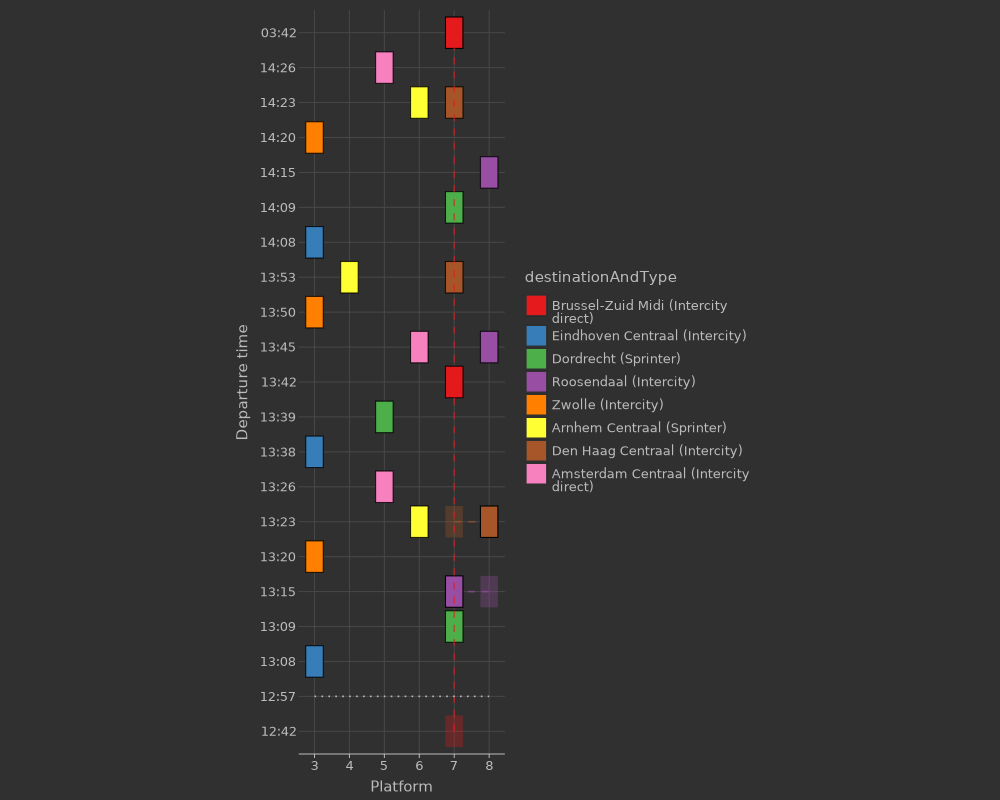
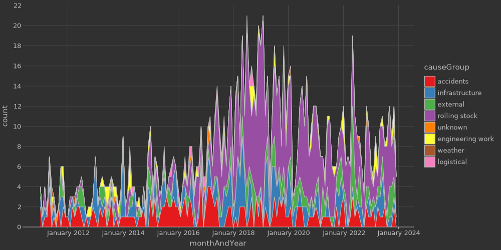

# Kotlin Data Analysis & Notebooks (Amsterdam 2024)

This repo contains the notebooks and code used at the April 24'th
Kotlin MeetUp @Jetbrains in Amsterdam given by Jolan Rensen.

Tools used:
 - [Kotlin for Data Analysis (overview)](https://kotlinlang.org/docs/data-analysis-overview.html)
 - [Kotlin DataFrame](https://github.com/Kotlin/dataframe)
   - [Docs](https://kotlin.github.io/dataframe/overview.html)
 - [Kandy](https://github.com/Kotlin/kandy/tree/main)
   - [Docs](https://kotlin.github.io/kandy)
 - [Kotlin Jupyter kernel](https://github.com/Kotlin/kotlin-jupyter/tree/master) 
 - [Kotlin Notebook plugin for IntelliJ](https://plugins.jetbrains.com/plugin/16340-kotlin-notebook)
 - [IntelliJ Ultimate](https://www.jetbrains.com/idea/)
 - [Rijden de Treinen open data](https://www.rijdendetreinen.nl/en/open-data)
   - [Disruptions](https://www.rijdendetreinen.nl/en/open-data/disruptions)
   - [Railway stations](https://www.rijdendetreinen.nl/en/open-data/stations)
   - [GoTrain server](https://github.com/rijdendetreinen/gotrain)

Contact me:
 - [KotlinLang Slack](https://kotlinlang.slack.com/team/U034GU9M803)
 - [Email](mailto:jolan.rensen@jetbrains.com)
 - [LinkedIn (if I happen to look at it)](https://www.linkedin.com/in/jolanrensen)
 - [Telegram](https://humpsel.t.me)